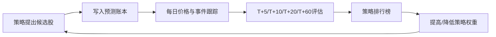

# Alpha Ledger v0.1 实施计划

## 目标

第一版不做全自动交易，也不做大而全平台。目标是让每条股票机会从第一天开始具备完整生命周期：

1. 事前：预测被记录，包含买入逻辑、买点、止损、目标和风险。
2. 事中：信号被跟踪，判断是否触发、确认、失效或进入止盈区。
3. 事后：收益被验证，策略被排名，权重被调整。

## MVP 边界

必须有：

- 策略库
- 预测账本
- 价格数据表
- 跟踪事件
- T+5 / T+10 / T+20 / T+60 评估
- 策略排行榜
- Markdown 报告

暂不做：

- 自动下单
- 复杂权限系统
- 炫酷前端
- 未验证策略的高权重推荐

## 数据流

## 策略进化规则

每个策略都看以下指标：

- 胜率
- 平均收益
- 盈亏比
- 最大回撤
- 命中目标率
- 止损触发率
- 是否跑赢指数

早期样本少时，不直接迷信排名；至少累计 30 条以上信号后，再让权重明显分化。

## 下一阶段

v0.2 应补齐：

- 美股和港股数据源接入
- 个股基础面摘要
- 公告/新闻/财报事件表
- 指数基准收益
- 策略权重自动调整
- 每日候选股自动生成

