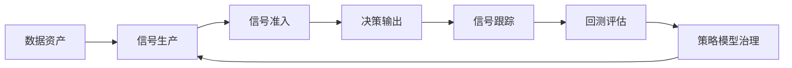
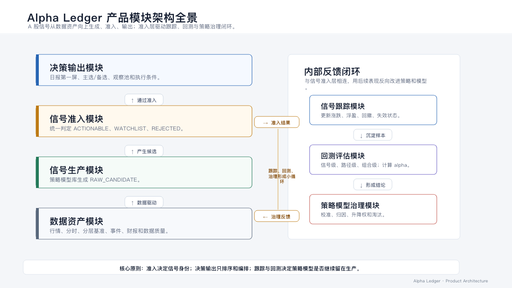
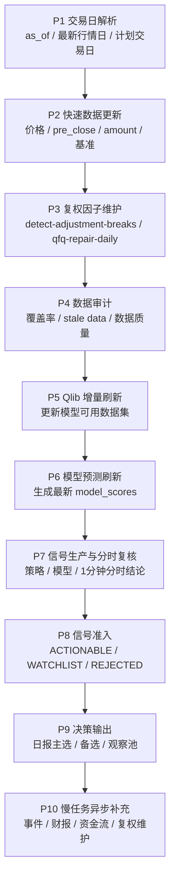
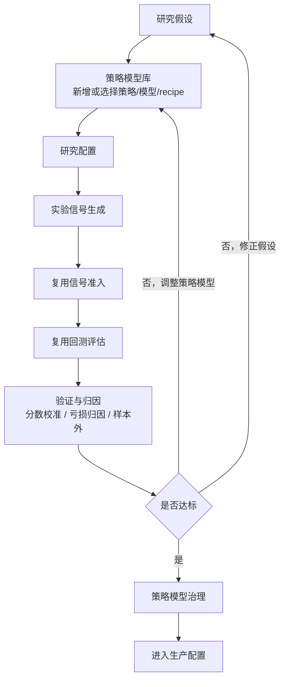

# Alpha Ledger 产品架构文档

> 版本：v1.4
> 日期：2026-06-03
> 定位：产品全景、使用流程、技术数据流和演进路线图。本文档用于统一方向和取舍，不替代 README、策略说明或运行报告。

## 1. 产品全景

Alpha Ledger 不是自动交易机器人，也不是泛资讯股票平台，而是一个以盈利验证为中心的 A 股量化研究账本。

它要解决的核心问题是：

> 每天从全市场中筛出少量真正值得研究和交易的股票，并用历史回放、真实交易规则、基准比较和组合表现不断验证这些股票是否真的有 alpha。

产品主线：



### 1.1 产品模块架构

Alpha Ledger 拆成七个产品模块。后续新增需求、代码改动和 agent 派活，都应该先判断属于哪个模块。



模块职责：

- 数据资产模块：保证本地数据可用、可审计、可复用。
- 信号生产模块：通过策略模型库生成原始候选。
- 信号准入模块：统一判断信号是否有资格进入可交易、观察或拒绝状态。
- 决策输出模块：把已准入信号排序、分组、限额并解释给用户。
- 信号跟踪模块：持续跟踪通过准入的信号后续表现。
- 回测评估模块：验证信号、交易路径和组合是否真实赚钱。
- 策略模型治理模块：根据验证结果决定策略和模型的保留、降权、淘汰或晋升。

### 1.2 核心产品对象

**数据仓库**

保存 A 股日线、分时、分层基准、事件、财报、模型分数和数据质量记录。它让日报和回测优先基于本地可复用数据，而不是每次临时请求接口。

**候选账本**

`candidates` 是项目主账本。只有由策略或模型在当时可见数据下产生的股票，才能进入候选账本。主观灵感、朋友提示、新闻印象不能直接入账，只能先转化为可回放规则。

**策略模型库**

策略模型库是信号生产模块的核心组件，保存所有原子化策略、模型和组合规则。用户未来可以选择若干策略和模型组成研究配置，但这些配置必须经过统一准入和回测评估后，才能进入生产配置。

**每日交易计划**

最终用户每天主要看日报第一屏：今天是否适合交易、最多 5 个主选、备选和观察池、买入条件、止损、目标、仓位和失效条件。

### 1.3 产品边界

当前正式赚钱主线只做 A 股 `CN_A`。

美股、港股保留实验能力，但不进入正式收益结论和每日买入清单。Kronos、其他深度模型、新事件源、新因子都属于研究分支，只有证明样本外增量 alpha 后才能进入正式流程。

系统不保证任何股票上涨。它的价值是把每次候选变成可复盘样本，并用净收益、回撤、止损率、分数校准和超额收益逼迫策略进化。

### 1.4 信号状态

从信号生产到决策输出，信号状态应保持统一：

- `RAW_CANDIDATE`：信号生产模块产出的原始候选。
- `REJECTED_BY_GATE`：被信号准入模块挡掉，并记录原因。
- `WATCHLIST`：观察信号，暂未进入正式可交易。
- `ACTIONABLE_SIGNAL`：通过准入，可交易。
- `PLAN_PRIMARY`：决策输出中的主选。
- `PLAN_BACKUP`：决策输出中的备选。

核心原则：

> 准入决定信号身份，决策输出决定优先级和执行编排。

过了准入后，决策输出模块不应再用另一套逻辑把信号判为无效，只能排序、分组、限额和解释。

## 2. 产品使用流程

Alpha Ledger 的正确用法不是打开很多报告到处找股票，而是按固定流程使用。

### 2.1 每日交易流程

每天收盘后，系统先跑生产 Pipeline，生成每日交易计划。

日报第一屏必须回答：

- 数据截止日是什么。
- 计划交易日是什么。
- 今天是否适合开仓。
- 主选和备选分别是什么。
- 每只股票为什么买、怎么买、错了在哪里止损。

时间点规范：

- `--as-of` 表示数据截止日，不表示自然日今天。
- `data_as_of_date` 是最后一个完整入库交易日。
- `trade_plan_date` 是数据截止日之后的下一个 A 股交易日。
- 如果用户指定的 `as_of` 晚于本地最新行情日，日报必须标记 `STALE_DATA`，不得输出可买清单。

### 2.2 信号跟踪流程

信号账本要完整，用户跟踪要克制。

跟踪规则：

- `ACTIONABLE_SIGNAL`：全部进入信号跟踪。
- `PLAN_PRIMARY`：重点跟踪。
- `PLAN_BACKUP`：低优先级跟踪。
- `WATCHLIST`：不默认进入核心跟踪，只进入观察队列或研究记录。
- `REJECTED_BY_GATE`：只记录拒绝原因，不进入跟踪。

信号跟踪模块每天更新：

- 当前涨跌幅。
- 最大浮盈和最大回撤。
- 是否触发止损、目标、确认或失效。
- 主选、备选和观察队列的状态变化。

### 2.3 研究复盘流程

研究主要发生在信号生产模块，核心入口是策略模型库。

标准流程：

1. 在策略模型库里选择或新增策略、模型、组合规则。
2. 形成研究配置。
3. 产生实验信号。
4. 复用生产系统的信号准入、回测评估和分层基准。
5. 做亏损归因和分数校准。
6. 达标后进入策略模型治理流程。
7. 通过治理后进入生产配置。

用户未来可以选择：

- 三个策略 + 一个模型。
- 一个策略 + 三个模型。
- 只跑模型高分。
- 只跑事件策略。
- 跑某个组合 recipe。

但选择组合不等于组合有效。每个策略、模型和 recipe 都必须有版本、历史表现卡片和样本外验证结果。

### 2.4 用户每天应该看什么

优先级如下：

1. `daily_plan_<date>.md`：今天是否行动、主选和备选是什么。
2. 信号跟踪摘要：过去几天系统选出的股票后来怎么走。
3. 组合回测报告：当前系统整体是否真的赚钱。
4. 策略审计和 score calibration：策略和模型是否还能信。
5. loss review：最近亏损来自哪里，哪些信号应该被过滤。

## 3. 技术结构与数据流

技术结构分为两条 Pipeline：生产 Pipeline 和研究 Pipeline。

生产 Pipeline 用来每天稳定出日报；研究 Pipeline 用来发现未来可能赚钱的新逻辑。两者账本隔离，但共享同一套数据读取、信号准入、回测评估、分层基准和策略治理口径。

### 3.1 生产 Pipeline

生产 Pipeline 只能使用已经批准的策略、模型和参数版本。

唯一推荐生产入口：

```bash
python -m alpha_ledger production-run --as-of YYYY-MM-DD
```

`daily-plan` / `daily-run` 是旧/研究入口，不作为正式生产路径。



关键约束：

- 模型预测刷新必须进入日报前置流程。
- 每天不一定重训模型，但必须确认当天 `model_scores` 是最新可用状态。
- 每日复权主路径是 `pre_close` 断点检测和 `adj_factor` 快修；BaoStock 只作为补漏和校验源。
- 日报前置分时只拉信号池 1 分钟数据，用于执行结论和风险提示，不做全市场分时。
- 事件、公告、财报、资金流等慢任务不应阻塞价格、基准、模型预测和日报。

### 3.2 研究 Pipeline

研究 Pipeline 的核心改动应优先集中在信号生产模块。



研究 Pipeline 的输出应隔离，例如：

- `research_runs`
- `research_candidates`
- `research_metrics`
- 实验报告
- 实验版 `model_scores`

核心原则：

> 生产 Pipeline 是每天赚钱用的，研究 Pipeline 是发现未来赚钱逻辑用的。两者账本隔离，但准入、回测和评估口径统一。

### 3.3 策略模型库

策略模型库分四类：

**技术策略**

例如趋势突破、异常放量、低位首阳、回调确认、形态/缠论类策略。

**事件策略**

例如硬事件催化、财报超预期、产业催化、回购增持、兴业科技型低位重估。

**模型策略**

例如 Qlib Alpha158、Alpha360、LGBM、多周期模型、未来可能的 Kronos。

**组合规则**

例如策略 A + 模型 B 双高、事件 + 量价确认、PEAD + 模型过滤、低位重估 + 放量首阳 + 模型分支持。

### 3.4 回测评估模块

回测评估模块是一个大模块，不再拆成“回放评估”和“组合回测”两个并列模块。

它包含三个层次：

- 信号级回测：单个信号的 T+5 / T+10 / T+20 / T+60 收益、止损、目标命中、是否跑赢基准。
- 路径级回测：按真实交易规则模拟入场、止损、止盈、持有到期。
- 组合级回测：每天最多买几只、如何分仓、资金曲线、最大回撤、组合 alpha。

正式评估必须贴近真实交易：

- A 股遵守 T+1。
- 入场优先使用次一交易日开盘后的前 5 根 5 分钟 K 线 VWAP。
- 止损和止盈按路径先后判断。
- 涨停买不进，跌停卖不出时延期退出。
- 收益扣除交易成本。
- 每笔交易计算分层基准收益和超额收益。

## 4. 后续演进路线图

### Phase 1：产品收敛

目标：把项目从功能堆叠收回到清晰主线。

- 以本文档作为产品主参考。
- 清理 README、CLAUDE、IMPLEMENTATION_PLAN 中过期或重复的说法。
- 固化日报第一屏结构。
- 落地生产 Pipeline，避免漏更新价格、基准或模型分。
- 拆分快任务和慢任务，价格与基准先出日报，事件异步补。

### Phase 2：信号跟踪

目标：让用户每天能看到系统过去选出的股票后来怎么走。

- 建立信号跟踪池。
- 区分主选、备选、观察队列。
- 跟踪涨跌幅、最大浮盈、最大回撤、止损、目标和失效状态。
- 在日报中增加简洁的信号跟踪摘要。

### Phase 3：Alpha 强化

目标：让候选更少、更准、更可赚钱。

- 重新评估所有正式策略的分层基准超额收益。
- 做策略分和模型分交叉分桶。
- 验证高模型分是否真的优于低模型分。
- 用亏损标签反向收紧过滤器。
- 对兴业科技型策略做样本扩展和失败边界定义。

### Phase 4：策略模型库

目标：把策略、模型和组合规则做成可选、可评估、可晋升的原子化组件。

- 为每个策略、模型、recipe 建立版本和表现卡片。
- 支持研究配置选择多个策略和模型。
- 隔离研究账本和生产账本。
- 建立从研究配置到生产配置的晋升机制。

### Phase 5：组合与风控

目标：从单票看起来不错升级到组合真实能活下来。

- 统一正式组合回测口径。
- 加强仓位管理、风险平价、单票上限、单策略上限。
- 市场走弱、连续亏损、回撤扩大时自动降仓。
- 每日主选最多 5 个，观察池控制在合理范围内。

### Phase 6：模型研究

目标：找到可持续提供增量 alpha 的模型路线。

- 系统比较 Qlib Alpha158、Alpha360、LGBM 和多周期 ensemble。
- 建立模型漂移监控。
- Kronos 继续作为研究分支，只有样本外显著优于 Alpha158 基线后才进入主流程。
- 新模型进入 `model_scores` 前必须通过 IC、Rank IC、Top/Bottom spread、组合回测和分层基准验证。

### Phase 7：自动化与体验

目标：在主线有效后提高使用效率。

- 本地定时数据更新。
- 日报自动生成和归档。
- 轻量 Web 或表格化界面。
- 更好的候选跟踪、复盘和策略审计视图。

展示和平台化排在最后。只有当数据、策略、模型、交易规则和组合回测都能支持赚钱目标时，才值得继续优化体验。
